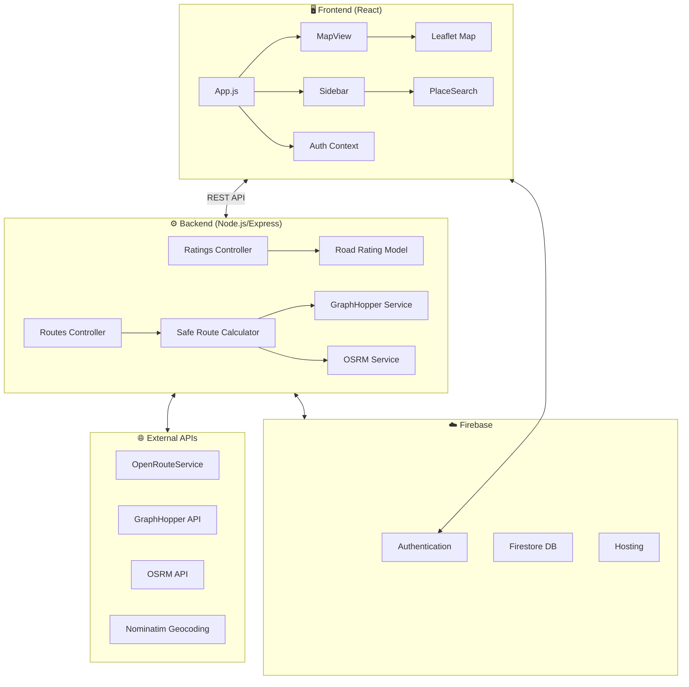

<p align="center">
  
</p>

<h1 align="center">🛣️ Safe Route</h1>

<p align="center">
  <strong>Intelligent Route Safety Navigation System for India</strong>
</p>

<p align="center">
  <a href="https://safe-route-127fd.web.app/">
    
  </a>
</p>

<p align="center">
  
  
  
  
  
</p>

<p align="center">
  
  
  
</p>

---

## 📋 Table of Contents

- [🎯 Problem Statement](#-problem-statement)
- [✨ Features](#-features)
- [🏗️ Architecture](#️-architecture)
- [🛠️ Tech Stack](#️-tech-stack)
- [🚀 Getting Started](#-getting-started)
- [📖 Usage Guide](#-usage-guide)
- [🔧 API Reference](#-api-reference)
- [🧪 Testing](#-testing)
- [🚢 Deployment](#-deployment)
- [🗺️ Roadmap](#️-roadmap)
- [🤝 Contributing](#-contributing)
- [📄 License](#-license)

---

## 🎯 Problem Statement

<table>
<tr>
<td width="60%">

**India faces a critical road safety crisis** with over **150,000 road fatalities annually**. Traditional navigation systems focus solely on finding the shortest or fastest routes without considering safety factors.

**Safe Route** addresses this gap by creating a platform where:

- 👥 Users can **share knowledge** about road conditions and safety
- 🧠 Algorithms can **calculate routes** that balance safety with travel time
- 🚗 Travelers can make **informed decisions** based on comprehensive route information

</td>
<td width="40%">

```
🛣️ Traditional Navigation
━━━━━━━━━━━━━━━━━━━━━━━━
✓ Shortest route
✓ Fastest route
✗ Safety considerations
✗ Road condition data
✗ Crowdsourced insights

🛡️ Safe Route Navigation
━━━━━━━━━━━━━━━━━━━━━━━━
✓ Safety-prioritized routing
✓ Crowdsourced road ratings
✓ Real-time safety scores
✓ Multiple route options
✓ Community-driven data
```

</td>
</tr>
</table>

---

## ✨ Features

### 🧭 Intelligent Route Calculation

| Feature                          | Description                                                              |
| -------------------------------- | ------------------------------------------------------------------------ |
| **Safety-Prioritized Algorithm** | Custom weighted algorithm balancing **70% safety** + **30% travel time** |
| **Multiple Routing Services**    | Integration with OpenRouteService, GraphHopper, and OSRM                 |
| **Fallback Mechanisms**          | Graceful degradation when external services are unavailable              |
| **Route Caching**                | Firebase-powered route caching for improved performance                  |

### ⭐ Crowdsourced Road Ratings

```
┌─────────────────────────────────────────────────────┐
│  📍 Segment-Based Rating System                     │
│  ─────────────────────────────────────────────────  │
│  • Roads divided into ~2km segments                 │
│  • Binary "Good" or "Bad" ratings                   │
│  • Aggregated 0-100 safety scores                   │
│  • Recent ratings given higher weight               │
└─────────────────────────────────────────────────────┘
```

### 🗺️ Interactive Map Interface

- **Leaflet Integration** - High-performance map rendering with React-Leaflet
- **Visual Safety Indicators** - Color-coded route segments based on safety ratings
- **Interactive Elements** - Clickable segments for rating submission
- **Custom Markers** - Start, destination, and user location markers

### 🔐 Authentication System

- **Firebase Authentication** - Secure email/password authentication
- **Protected Routes** - Map functionality accessible only to authenticated users
- **User Data Storage** - Firestore-based user profile management
- **Location Permission** - Consent-based location access during registration

### 📍 Location Services

- **Geolocation Integration** - Automatic detection of user's current location
- **Search with Autocomplete** - Location search powered by Nominatim API
- **India-Specific Boundaries** - Optimized for Indian geographical context

---

## 🏗️ Architecture



### Data Flow

```
1️⃣ Location Input    → User inputs start and destination locations
2️⃣ Route Request     → Client requests route options from server
3️⃣ External API      → Server communicates with routing services
4️⃣ Safety Enhancement → Server applies safety data to routes
5️⃣ Response Delivery → Enhanced routes returned to client
6️⃣ Visualization     → Client renders routes with safety indicators
7️⃣ User Feedback     → Ratings submitted back to server for storage
```

---

## 🛠️ Tech Stack

<table>
<tr>
<td valign="top" width="50%">

### Frontend

| Technology                                                                                                             | Purpose       |
| ---------------------------------------------------------------------------------------------------------------------- | ------------- |
|                    | UI Framework  |
|                 | Map Rendering |
|       | Styling       |
|  | Navigation    |
|                       | HTTP Client   |

</td>
<td valign="top" width="50%">

### Backend

| Technology                                                                                                       | Purpose          |
| ---------------------------------------------------------------------------------------------------------------- | ---------------- |
|           | Runtime          |
|           | Web Framework    |
|  | Backend Services |
|                      | ODM (Future)     |

</td>
</tr>
</table>

### External Services

| Service             | Purpose                 | Documentation                                       |
| ------------------- | ----------------------- | --------------------------------------------------- |
| 🗺️ OpenRouteService | Primary routing service | [Docs](https://openrouteservice.org/dev/#/api-docs) |
| 🚗 GraphHopper      | Alternative routing     | [Docs](https://docs.graphhopper.com/)               |
| 🛣️ OSRM             | Backup routing          | [Docs](http://project-osrm.org/docs/)               |
| 📍 Nominatim        | Geocoding               | [Docs](https://nominatim.org/release-docs/latest/)  |
| 🔥 Firebase         | Auth, DB, Hosting       | [Docs](https://firebase.google.com/docs)            |

---

## 🚀 Getting Started

### Prerequisites

- **Node.js** v14 or higher
- **npm** v6 or higher
- **Firebase Account** with a configured project
- **API Keys** for routing services (optional, uses public APIs by default)

### Installation

```bash
# 1️⃣ Clone the repository
git clone https://github.com/yourusername/SAFE_ROUTE.git
cd SAFE_ROUTE/safe-route

# 2️⃣ Install all dependencies (root, server, and client)
npm run install-all

# 3️⃣ Configure Firebase
# Create client/src/firebase/config.js with your Firebase config

# 4️⃣ Configure server environment
# Create server/.env with required environment variables
```

### Firebase Configuration

Create `client/src/firebase/config.js`:

```javascript
const firebaseConfig = {
  apiKey: "YOUR_API_KEY",
  authDomain: "YOUR_AUTH_DOMAIN",
  projectId: "YOUR_PROJECT_ID",
  storageBucket: "YOUR_STORAGE_BUCKET",
  messagingSenderId: "YOUR_MESSAGING_SENDER_ID",
  appId: "YOUR_APP_ID",
};

export default firebaseConfig;
```

### Running the Application

```bash
# 🚀 Start both server and client concurrently
npm start

# Or run separately:

# Terminal 1 - Start the server
cd server && npm run dev

# Terminal 2 - Start the client
cd client && npm start
```

The application will be available at:

- **Frontend**: http://localhost:3000
- **Backend API**: http://localhost:5000

---

## 📖 Usage Guide

### 🔑 Authentication

1. **Register** with email and password
2. **Grant location permission** during registration
3. **Login** to access the map interface

### 🗺️ Finding a Route

```
┌─────────────────────────────────────────────────────────┐
│  Step 1: Enter Start Location                          │
│  ─────────────────────────────────────────────────────  │
│  • Use "Current Location" button, OR                   │
│  • Type address in the search box                      │
├─────────────────────────────────────────────────────────┤
│  Step 2: Enter Destination                             │
│  ─────────────────────────────────────────────────────  │
│  • Type destination address                            │
│  • Select from autocomplete suggestions                │
├─────────────────────────────────────────────────────────┤
│  Step 3: Toggle Safety Priority (Optional)             │
│  ─────────────────────────────────────────────────────  │
│  • Enable for safety-prioritized routing               │
│  • Disable for fastest route                           │
├─────────────────────────────────────────────────────────┤
│  Step 4: Calculate Route                               │
│  ─────────────────────────────────────────────────────  │
│  • Click "Calculate Route" button                      │
│  • View route with safety indicators                   │
└─────────────────────────────────────────────────────────┘
```

### ⭐ Rating Road Segments

1. Calculate a route between two locations
2. Click on any segment of the displayed route
3. In the popup, rate the road as **"Good"** or **"Bad"**
4. Your rating will influence future route calculations

---

## 🔧 API Reference

### Routes API

| Endpoint                | Method | Description                        |
| ----------------------- | ------ | ---------------------------------- |
| `/api/routes/calculate` | POST   | Calculate route between two points |

**Request Body:**

```json
{
  "start": { "lat": 28.6139, "lng": 77.209 },
  "destination": { "lat": 28.5355, "lng": 77.391 },
  "prioritizeSafety": true
}
```

**Response:**

```json
{
  "success": true,
  "route": [...],
  "distance": 25.4,
  "estimatedTime": 45,
  "safetyScore": 78,
  "segments": [...]
}
```

### Ratings API

| Endpoint              | Method | Description                   |
| --------------------- | ------ | ----------------------------- |
| `/api/ratings`        | POST   | Submit a new road rating      |
| `/api/ratings/bounds` | GET    | Get ratings within map bounds |

---

## 🧪 Testing

```bash
# Run client tests
cd client && npm test

# Run server tests
cd server && npm test
```

---

## 🚢 Deployment

The application uses **Firebase Hosting** with automated CI/CD via GitHub Actions.

### Automatic Deployment

- **Merge to `main`** → Deploys to production
- **Pull Requests** → Creates preview deployments

### Manual Deployment

```bash
# Build the client
cd client && npm run build

# Deploy to Firebase
firebase deploy --only hosting
```

### Live Application

🔗 **[https://safe-route-127fd.web.app/](https://safe-route-127fd.web.app/)**

---

## 🗺️ Roadmap

### Current Status ✅

- [x] Multi-service route calculation
- [x] Crowdsourced road ratings
- [x] Firebase authentication
- [x] Interactive map interface
- [x] Safety-prioritized routing algorithm

### Upcoming Features 🚧

- [ ] **Machine Learning Integration** - Predictive safety models
- [ ] **Detailed Rating Categories** - Specific hazard types (potholes, traffic, etc.)
- [ ] **Temporal Analysis** - Time-based safety patterns (day/night, seasonal)
- [ ] **Mobile Applications** - Native iOS and Android versions
- [ ] **Offline Functionality** - Enhanced capabilities without internet
- [ ] **Vehicle System Integration** - API for in-vehicle navigation

---

## 📁 Project Structure

```
SAFE_ROUTE/
├── 📁 .github/
│   └── 📁 workflows/          # GitHub Actions CI/CD
├── 📁 safe-route/
│   ├── 📁 client/             # React Frontend
│   │   ├── 📁 public/         # Static assets
│   │   └── 📁 src/
│   │       ├── 📁 components/ # React components
│   │       ├── 📁 contexts/   # React contexts
│   │       ├── 📁 firebase/   # Firebase config & services
│   │       ├── 📁 pages/      # Page components
│   │       ├── 📁 services/   # API services
│   │       ├── 📁 styles/     # CSS styles
│   │       └── 📁 utils/      # Utility functions
│   ├── 📁 server/             # Node.js Backend
│   │   ├── 📁 controllers/    # Route handlers
│   │   ├── 📁 models/         # Data models
│   │   ├── 📁 routes/         # API routes
│   │   └── 📁 utils/          # Utility functions
│   ├── 📄 firebase.json       # Firebase configuration
│   ├── 📄 firestore.rules     # Firestore security rules
│   └── 📄 package.json        # Project dependencies
└── 📄 README.md               # You are here!
```

---

## 🤝 Contributing

Contributions are welcome! Please read our contributing guidelines before submitting a pull request.

1. **Fork** the repository
2. **Create** a feature branch (`git checkout -b feature/AmazingFeature`)
3. **Commit** your changes (`git commit -m 'Add AmazingFeature'`)
4. **Push** to the branch (`git push origin feature/AmazingFeature`)
5. **Open** a Pull Request

---

## 🙏 Acknowledgments

- **OpenStreetMap** for map data
- **Leaflet** for map visualization
- **OpenRouteService** for routing API
- **Firebase** for backend services
- The research community for guidance on safety metrics

---

## 📄 License

This project is licensed under the **ISC License** - see the [LICENSE](LICENSE) file for details.

---

<p align="center">
  <strong>Made with ❤️ for safer roads in India</strong>
</p>

<p align="center">
  <a href="https://safe-route-127fd.web.app/">
    
  </a>
</p>
