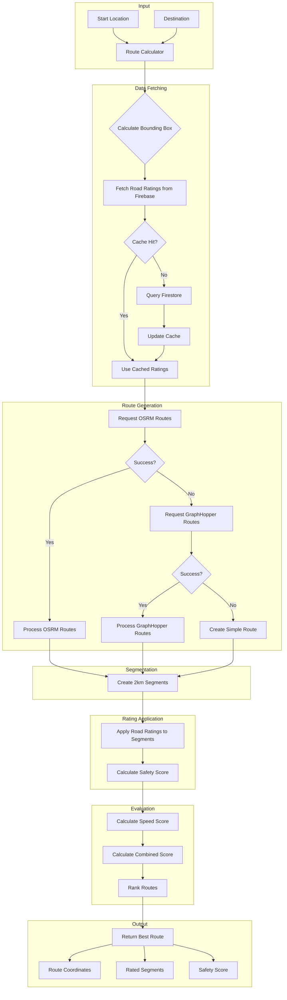

# 🧠 Safe Route Algorithm Documentation

## Overview

The Safe Route algorithm is a **safety-prioritized routing system** that calculates optimal travel routes by balancing road safety ratings with travel efficiency. Unlike traditional navigation systems that focus solely on distance or time, this algorithm incorporates crowdsourced safety data to recommend routes that are both efficient and safe.

---

## Table of Contents

1. [Algorithm Architecture](#algorithm-architecture)
2. [Core Components](#core-components)
3. [Step-by-Step Process](#step-by-step-process)
4. [Mathematical Formulas](#mathematical-formulas)
5. [Route Segmentation](#route-segmentation)
6. [Safety Score Calculation](#safety-score-calculation)
7. [Route Evaluation & Selection](#route-evaluation--selection)
8. [Fallback Mechanisms](#fallback-mechanisms)
9. [Data Flow Diagram](#data-flow-diagram)
10. [Code Examples](#code-examples)

---

## Algorithm Architecture

```
┌─────────────────────────────────────────────────────────────────────────────┐
│                        SAFE ROUTE ALGORITHM FLOW                            │
├─────────────────────────────────────────────────────────────────────────────┤
│                                                                             │
│   START                                                                     │
│     │                                                                       │
│     ▼                                                                       │
│   ┌─────────────────────┐                                                   │
│   │  Input: Start &     │                                                   │
│   │  Destination Points │                                                   │
│   └──────────┬──────────┘                                                   │
│              │                                                              │
│              ▼                                                              │
│   ┌─────────────────────┐     ┌─────────────────────┐                       │
│   │  Calculate Bounding │────▶│  Fetch Road Ratings │                       │
│   │  Box (+5km buffer)  │     │  from Firebase      │                       │
│   └──────────┬──────────┘     └──────────┬──────────┘                       │
│              │                           │                                  │
│              ▼                           ▼                                  │
│   ┌─────────────────────────────────────────────────┐                       │
│   │         Request Routes from APIs                │                       │
│   │  ┌─────────┐  ┌────────────┐  ┌──────────┐     │                       │
│   │  │  OSRM   │  │ GraphHopper│  │ Fallback │     │                       │
│   │  │(Primary)│  │ (Secondary)│  │ (Simple) │     │                       │
│   │  └─────────┘  └────────────┘  └──────────┘     │                       │
│   └──────────────────────┬──────────────────────────┘                       │
│                          │                                                  │
│                          ▼                                                  │
│   ┌─────────────────────────────────────────────────┐                       │
│   │      Divide Routes into 2km Segments            │                       │
│   └──────────────────────┬──────────────────────────┘                       │
│                          │                                                  │
│                          ▼                                                  │
│   ┌─────────────────────────────────────────────────┐                       │
│   │    Apply Road Ratings to Each Segment           │                       │
│   │    (Match ratings within 500m buffer)           │                       │
│   └──────────────────────┬──────────────────────────┘                       │
│                          │                                                  │
│                          ▼                                                  │
│   ┌─────────────────────────────────────────────────┐                       │
│   │         Calculate Safety Score                  │                       │
│   │   safetyScore = 100 - (badSegments/total × 100) │                       │
│   └──────────────────────┬──────────────────────────┘                       │
│                          │                                                  │
│                          ▼                                                  │
│   ┌─────────────────────────────────────────────────┐                       │
│   │           Evaluate & Rank Routes                │                       │
│   │   combinedScore = (safety × 0.7) + (speed × 0.3)│                       │
│   └──────────────────────┬──────────────────────────┘                       │
│                          │                                                  │
│                          ▼                                                  │
│   ┌─────────────────────┐                                                   │
│   │  Return Best Route  │                                                   │
│   │  with Segments &    │                                                   │
│   │  Safety Data        │                                                   │
│   └─────────────────────┘                                                   │
│                                                                             │
│   END                                                                       │
│                                                                             │
└─────────────────────────────────────────────────────────────────────────────┘
```

---

## Core Components

### 1. Distance Calculation (Haversine Formula)

The algorithm uses the **Haversine formula** to calculate distances between geographic coordinates on Earth's surface.

```javascript
function haversineDistance(lat1, lng1, lat2, lng2) {
  const R = 6371; // Earth's radius in kilometers

  const dLat = ((lat2 - lat1) * Math.PI) / 180;
  const dLng = ((lng2 - lng1) * Math.PI) / 180;

  const a =
    Math.sin(dLat / 2) * Math.sin(dLat / 2) +
    Math.cos((lat1 * Math.PI) / 180) *
      Math.cos((lat2 * Math.PI) / 180) *
      Math.sin(dLng / 2) *
      Math.sin(dLng / 2);

  const c = 2 * Math.atan2(Math.sqrt(a), Math.sqrt(1 - a));

  return R * c; // Distance in kilometers
}
```

**Mathematical Formula:**

```
a = sin²(Δlat/2) + cos(lat₁) × cos(lat₂) × sin²(Δlng/2)
c = 2 × atan2(√a, √(1-a))
d = R × c

Where:
  - R = 6371 km (Earth's radius)
  - lat₁, lat₂ = Latitudes of points 1 and 2
  - lng₁, lng₂ = Longitudes of points 1 and 2
  - d = Distance between points
```

### 2. Bounding Box Calculation

Creates a geographic bounding box around the route area with a 5km buffer for fetching relevant road ratings.

```javascript
function getBoundingBox(point1, point2) {
  const buffer = 0.05; // ~5km buffer

  return {
    north: Math.max(point1.lat, point2.lat) + buffer,
    south: Math.min(point1.lat, point2.lat) - buffer,
    east: Math.max(point1.lng, point2.lng) + buffer,
    west: Math.min(point1.lng, point2.lng) - buffer,
  };
}
```

---

## Step-by-Step Process

### Step 1: Input Processing

```
Input:
  - startLocation: { lat: Number, lng: Number }
  - destination: { lat: Number, lng: Number }
  - prioritizeSafety: Boolean (default: true)
```

### Step 2: Fetch Road Ratings

1. Calculate bounding box between start and destination
2. Query Firebase Firestore for road ratings within the bounds
3. Check cache for recent data (< 1 hour old)
4. If cache miss, fetch fresh ratings and cache them

```
Cache Strategy:
  - Cache Key: "{north}_{south}_{east}_{west}" (3 decimal precision)
  - Cache TTL: 1 hour (3,600,000 ms)
  - Fallback: Mock data if Firebase fails
```

### Step 3: Request Routes from APIs

**Priority Order:**

| Priority | Service      | Description                                     |
| -------- | ------------ | ----------------------------------------------- |
| 1st      | OSRM         | Open Source Routing Machine (Primary)           |
| 2nd      | GraphHopper  | Alternative routing with API key                |
| 3rd      | Simple Route | Straight-line fallback with interpolated points |

### Step 4: Route Segmentation

Each route is divided into **~2km segments** for granular safety analysis.

### Step 5: Apply Road Ratings

Match existing road ratings to each segment based on geographic overlap.

### Step 6: Calculate Safety Score

Compute overall safety score based on segment ratings.

### Step 7: Route Evaluation

Rank routes by combined score (safety + speed).

### Step 8: Return Best Route

Select and return the route with the highest combined score.

---

## Route Segmentation

### Why 2km Segments?

- **Granularity**: Small enough for precise ratings
- **Usability**: Large enough to be meaningful to users
- **Performance**: Manageable number of segments for long routes

### Segmentation Algorithm

```javascript
function createRouteSegments(routePoints) {
  const segments = [];
  let currentSegmentDistance = 0;
  let segmentPoints = [routePoints[0]];

  for (let i = 1; i < routePoints.length; i++) {
    const point = routePoints[i];
    const prevPoint = routePoints[i - 1];

    // Calculate distance between consecutive points
    const pointDistance = haversineDistance(
      prevPoint.lat,
      prevPoint.lng,
      point.lat,
      point.lng,
    );

    segmentPoints.push(point);
    currentSegmentDistance += pointDistance;

    // Create segment when 2km is reached
    if (currentSegmentDistance >= 2) {
      segments.push({
        coordinates: {
          start: segmentPoints[0],
          end: point,
        },
        points: [...segmentPoints],
        distanceKm: currentSegmentDistance,
      });

      // Start new segment
      currentSegmentDistance = 0;
      segmentPoints = [point];
    }
  }

  return segments;
}
```

### Segment Data Structure

```javascript
{
  id: "segment-0-28.6139-77.2090-28.6300-77.2200",
  coordinates: {
    start: { lat: 28.6139, lng: 77.2090 },
    end: { lat: 28.6300, lng: 77.2200 }
  },
  points: [/* array of all points in segment */],
  distanceKm: 2.0,
  rating: "Good" | "Bad" | null,
  ratingCount: 5,
  badRatingCount: 1,
  goodRatingCount: 4
}
```

---

## Safety Score Calculation

### Basic Safety Score

```javascript
function calculateSegmentBasedSafetyScore(segments) {
  const ratedSegments = segments.filter((s) => s.rating !== null);

  if (ratedSegments.length === 0) {
    return 75; // Default score when no ratings exist
  }

  const badSegments = ratedSegments.filter((s) => s.rating === "Bad");
  const badSegmentPercentage =
    (badSegments.length / ratedSegments.length) * 100;

  // Safety score: 100 minus percentage of bad segments (min: 30)
  const safetyScore = Math.max(30, 100 - badSegmentPercentage);

  return safetyScore;
}
```

### Formula

```
safetyScore = max(30, 100 - (badSegments / totalRatedSegments × 100))

Where:
  - badSegments = Number of segments rated as "Bad"
  - totalRatedSegments = Total segments with ratings
  - Minimum score is capped at 30
```

### Advanced Safety Score (Weighted)

For more nuanced scoring, the algorithm also considers rating severity:

```javascript
// Calculate bad rating percentage within segment
const badRatingPercentage =
  (badRatings.length / applicableRatings.length) * 100;

// Apply severity weight (1.0 - 2.0 scale)
const severityWeight = Math.min(2.0, 1.0 + (badRatingPercentage - 30) / 70);

// Weighted count for more severely rated segments
badSegmentsWeight += severityWeight;

// Final weighted safety score
const safetyPercentage = 100 - (badSegmentsWeight / totalSegments) * 100;
```

---

## Route Evaluation & Selection

### Scoring Algorithm

Each route receives three scores:

1. **Safety Score** (0-100): Based on road ratings
2. **Speed Score** (0-100): Based on travel time comparison
3. **Combined Score**: Weighted combination of safety and speed

### Speed Score Calculation

```javascript
// Find the fastest route duration
const fastestDuration = Math.min(...routes.map((r) => r.duration));

// Calculate relative speed score
const speedScore =
  fastestDuration > 0
    ? Math.max(
        0,
        100 - ((route.duration - fastestDuration) / fastestDuration) * 100,
      )
    : 50;
```

### Combined Score Formula

```javascript
// Default weights when prioritizing safety
const safetyWeight = prioritizeSafety ? 0.8 : 0.2;
const speedWeight = prioritizeSafety ? 0.2 : 0.8;

// Calculate segment penalty for bad segments
const badSegmentRatio = badSegments.length / segments.length;
const segmentPenalty = badSegmentRatio * 25; // Up to 25 points

// Final combined score
const combinedScore =
  safetyScore * safetyWeight +
  speedScore * speedWeight -
  (prioritizeSafety ? segmentPenalty : segmentPenalty * 0.3);
```

### Weighting Table

| Priority Mode | Safety Weight | Speed Weight | Segment Penalty Multiplier |
| ------------- | ------------- | ------------ | -------------------------- |
| Safety First  | 80% (0.8)     | 20% (0.2)    | 100%                       |
| Speed First   | 20% (0.2)     | 80% (0.8)    | 30%                        |

### Route Ranking

Routes are sorted by combined score in descending order. The route with the **highest combined score** is selected as the optimal route.

```javascript
// Sort routes by combined score (higher is better)
evaluatedRoutes.sort((a, b) => b.combinedScore - a.combinedScore);

// Return the best route
return evaluatedRoutes[0];
```

---

## Fallback Mechanisms

The algorithm implements a **multi-tiered fallback system** to ensure route availability:

```
┌─────────────────────────────────────────────────────────────┐
│                    FALLBACK HIERARCHY                       │
├─────────────────────────────────────────────────────────────┤
│                                                             │
│   Level 1: OSRM (Public API)                                │
│      │                                                      │
│      ├── Success → Use routes                               │
│      │                                                      │
│      └── Failure ──────────────────────────┐                │
│                                            ▼                │
│   Level 2: GraphHopper (API Key)           │                │
│      │                                     │                │
│      ├── Success → Use routes              │                │
│      │                                     │                │
│      └── Failure ──────────────────────────┐                │
│                                            ▼                │
│   Level 3: Simple Route (Local Calculation)│                │
│      │                                     │                │
│      └── Creates straight-line route       │                │
│          with safety overlays              │                │
│                                                             │
└─────────────────────────────────────────────────────────────┘
```

### Simple Route Fallback

When all APIs fail, a simple straight-line route is generated:

```javascript
function createSimpleRoute(startPoint, endPoint, roadRatings) {
  const numPoints = 20; // Interpolation points
  const route = [startPoint];

  // Create intermediate points
  for (let i = 1; i < numPoints - 1; i++) {
    const ratio = i / numPoints;
    route.push({
      lat: startPoint.lat + (endPoint.lat - startPoint.lat) * ratio,
      lng: startPoint.lng + (endPoint.lng - startPoint.lng) * ratio
    });
  }

  route.push(endPoint);

  // Apply safety ratings even to simple route
  const segments = createRouteSegments(route);
  const ratedSegments = applyRoadRatingsToSegments(segments, roadRatings);

  return {
    route,
    segments: ratedSegments,
    distance: haversineDistance(...),
    duration: distance / 50 * 60, // Assume 50 km/h average
    safetyScore: calculateSegmentBasedSafetyScore(ratedSegments)
  };
}
```

---

## Data Flow Diagram



---

## Code Examples

### Example 1: Basic Route Calculation

```javascript
const { calculateSafeRoute } = require("./utils/safeRouteCalculator");

const startPoint = { lat: 28.6139, lng: 77.209 }; // New Delhi
const destPoint = { lat: 28.5355, lng: 77.391 }; // Noida

const route = await calculateSafeRoute(startPoint, destPoint, true);

console.log(route);
// Output:
// {
//   coordinates: [{ lat: 28.6139, lng: 77.2090 }, ...],
//   segments: [{ id: "...", rating: "Good", ... }, ...],
//   distance: 25.4,      // kilometers
//   time: 45,            // minutes
//   safetyScore: 78,     // 0-100 scale
//   source: "osrm"
// }
```

### Example 2: Route Evaluation Comparison

```javascript
// Evaluate multiple routes
const routes = [
  { duration: 30, safetyScore: 90, segments: [...] },
  { duration: 25, safetyScore: 60, segments: [...] },
  { duration: 35, safetyScore: 95, segments: [...] }
];

const evaluated = evaluateRoutes(routes, roadRatings, true);

// Route 3 wins with safety priority:
// - Safety: 95 × 0.8 = 76
// - Speed: ~86 × 0.2 = 17.2
// - Combined: ~93.2
```

### Example 3: Segment Rating Application

```javascript
const segments = [
  { id: "seg-1", coordinates: {...}, distanceKm: 2.0 },
  { id: "seg-2", coordinates: {...}, distanceKm: 2.0 }
];

const roadRatings = [
  { coordinates: {...}, rating: "Good" },
  { coordinates: {...}, rating: "Bad" }
];

const ratedSegments = applyRoadRatingsToSegments(segments, roadRatings);

// Result:
// [
//   { id: "seg-1", rating: "Good", goodRatingCount: 3, badRatingCount: 1 },
//   { id: "seg-2", rating: "Bad", goodRatingCount: 1, badRatingCount: 4 }
// ]
```

---

## Performance Considerations

### Caching Strategy

| Data               | Cache Duration | Storage            |
| ------------------ | -------------- | ------------------ |
| Road Ratings       | 1 hour         | Firebase Firestore |
| Route Calculations | Session        | Client-side        |

### Optimization Techniques

1. **Request Debouncing**: Prevent excessive API calls during user input
2. **Segment Validation**: Filter invalid coordinates before processing
3. **Parallel Requests**: Fetch ratings while requesting routes
4. **Early Termination**: Stop evaluation if a route clearly wins

---

## API Response Format

```javascript
{
  success: true,
  route: [
    { lat: 28.6139, lng: 77.2090 },
    { lat: 28.6145, lng: 77.2110 },
    // ... more coordinates
  ],
  segments: [
    {
      id: "segment-0-28.6139-77.2090-28.6300-77.2200",
      coordinates: {
        start: { lat: 28.6139, lng: 77.2090 },
        end: { lat: 28.6300, lng: 77.2200 }
      },
      distanceKm: 2.0,
      rating: "Good",
      ratingCount: 5,
      badRatingCount: 1,
      goodRatingCount: 4
    },
    // ... more segments
  ],
  distance: 25.4,        // Total distance in km
  estimatedTime: 45,     // Estimated time in minutes
  safetyScore: 78,       // Safety score (0-100)
  source: "osrm",        // Route source
  weights: {
    safetyWeight: 0.8,
    speedWeight: 0.2
  }
}
```

---

## Summary

The Safe Route algorithm provides an intelligent navigation solution that:

1. ✅ **Prioritizes safety** using crowdsourced road ratings
2. ✅ **Balances efficiency** with configurable safety/speed weights
3. ✅ **Ensures reliability** through multi-tiered fallback systems
4. ✅ **Enables granular feedback** via 2km road segments
5. ✅ **Optimizes performance** with caching and parallel processing

This approach enables travelers to make informed decisions about their routes, considering both safety and travel time based on real community feedback.

---

## Related Files

- [`safeRouteCalculator.js`](./server/utils/safeRouteCalculator.js) - Main algorithm implementation
- [`routesController.js`](./server/controllers/routesController.js) - API endpoint handler
- [`ratingsController.js`](./server/controllers/ratingsController.js) - Rating management
- [`graphHopperService.js`](./server/utils/graphHopperService.js) - GraphHopper API integration
- [`osrmService.js`](./server/utils/osrmService.js) - OSRM API integration

---

<p align="center">
  <strong>Made with 🧠 for safer navigation</strong>
</p>
